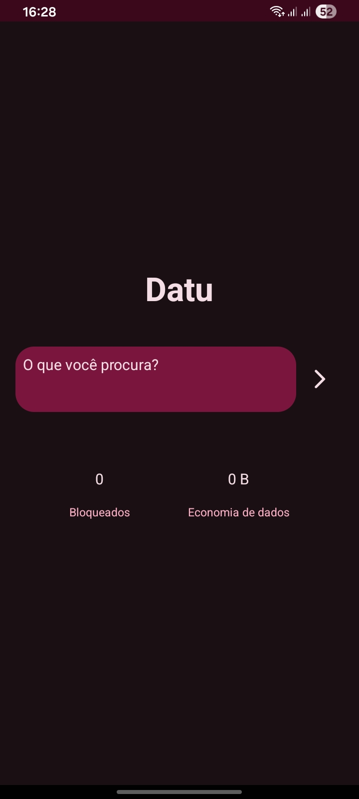
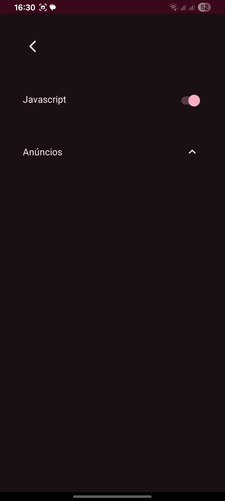

Datu Browser

Um navegador rápido e minimalista para Android.

Um projeto independente feito por mim como hobby.

📱 Screenshots

🌐 Sobre o Datu

O Datu foi criado pra ser um navegador rápido e minimalista, pra quem quer só o essencial.

Eu ainda tô trabalhando no projeto e ele está em fase Beta.

Então algumas coisas ainda podem não estar perfeitas.

Você pode encontrar páginas que carregam devagar, algum site que não funciona direito ou algum outro erro.

Também não consegui testar o Datu 100% em todos os dispositivos.

Em alguns pode estar tudo ok, mas em outros pode acontecer algum problema.

Ainda faltam alguns recursos no app. Eu tô trabalhando nisso, mas no momento tô focando mais na otimização e em deixar o navegador mais leve e rápido.

---

🚀 Características

- 🌐 Navegação simples e minimalista
- ⚡ Foco em velocidade e otimização
- 🛡️ Bloqueio de anúncios
- 📋 Listas do uBlock Origin
- 🔄 Atualização das listas pelas configurações
- 📱 Feito para Android
- 🪶 Projeto focado em ser leve
- 🔧 Desenvolvimento independente

---

🛡️ Bloqueio de anúncios

O Datu usa listas do uBlock Origin pra ajudar no bloqueio de anúncios e rastreadores.

As listas podem ser atualizadas pelas configurações do próprio app.

Elas não ficam integradas diretamente no aplicativo.

Mesmo assim, alguns anúncios podem passar pelo bloqueio.

Isso é esperado por enquanto. O sistema de bloqueio ainda está em desenvolvimento e eu ainda tô ajustando algumas coisas.

---

⚠️ Beta

Como o Datu ainda está em Beta, você pode encontrar:

- páginas carregando devagar;
- sites que não funcionam corretamente;
- problemas específicos em alguns dispositivos;
- recursos que ainda não foram adicionados;
- erros no bloqueador de anúncios.

O teste não foi 100% feito em todos os dispositivos.

Então a experiência pode mudar de aparelho pra aparelho.

---

📱 Compatibilidade

O Datu foi feito para Android.

Mas eu não consigo garantir que tudo vai funcionar da mesma forma em todos os aparelhos.

Se funcionar no seu aparelho, ótimo.

Se encontrar algum problema, pode me mandar um feedback.

---

🔧 Desenvolvimento

Eu levo o Datu como meu hobby, não como um trabalho.

Então algumas atualizações podem demorar pra sair.

Não tenho uma data certa pra cada atualização.

Mas se eu encontrar algum erro que realmente precisa ser corrigido, eu tento lançar uma versão rapidamente.

No momento, minha prioridade é:

- otimização;
- estabilidade;
- correção de erros;
- compatibilidade com sites.

---

🗺️ Próximos passos

Ainda quero adicionar e melhorar algumas coisas no Datu.

Por enquanto, meu foco é:

- melhorar a velocidade;
- corrigir bugs;
- melhorar o bloqueio de anúncios;
- melhorar a compatibilidade com sites;
- adicionar novos recursos aos poucos.

Não quero colocar um monte de coisa só por colocar.

Quero ir melhorando o Datu aos poucos.

---

🐛 Encontrou um erro?

Se você testar o Datu e encontrar algum erro, pode abrir uma Issue aqui no GitHub.

Se puder, coloque:

- modelo do aparelho;
- versão do Android;
- o que aconteceu;
- qual site ou recurso apresentou o problema;
- uma captura de tela, se possível.

Isso ajuda bastante a descobrir o que precisa ser corrigido.

---

💡 Sugestões

Também pode abrir uma Issue se tiver alguma ideia de recurso ou melhoria.

Eu não prometo que todas as sugestões vão entrar no Datu, mas posso analisar.

---

⭐ Apoie o projeto

Se você gostou do Datu ou achou a ideia interessante, pode deixar uma ⭐ no repositório.

Isso já ajuda a mostrar que tem gente acompanhando o projeto.

---

📦 Status

Versão: Beta

Plataforma: Android

Desenvolvimento: Independente

Tipo: Projeto pessoal / hobby

---

📄 Licença

Este projeto utiliza a licença definida no arquivo "LICENSE" deste repositório.

---

Datu Browser

Ainda tá no começo, ainda tem coisa pra melhorar... mas tô trabalhando nele.

